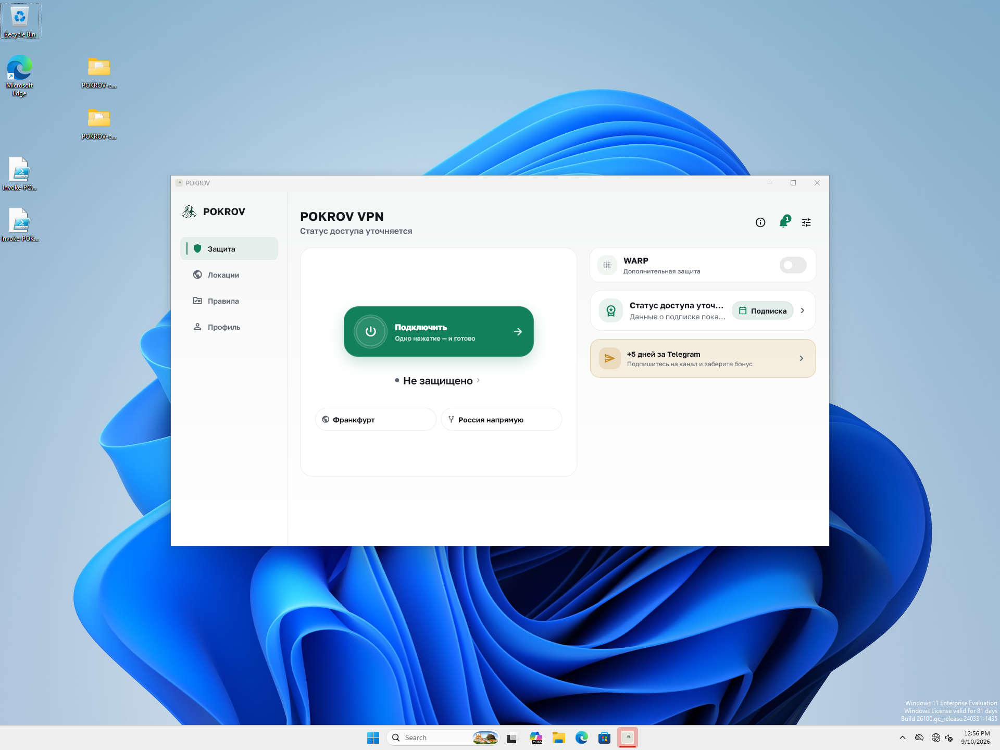

# Diagnostic build identity — исправление сборщиков

2026-09-10. Windows installed source `71ae96428c0f7c61b6db14dfce22f3e7b752b62d`,
Core `c7a11f7d2fd974726095ad7aa0619c055273dd15`, build `4053`.
**PASS_BOUNDED_BUILD_IDENTITY**. [Receipt](receipt.json),
[runtime checks](runtime-validation.json), [six local artifacts](artifact-inventory.json).

В предыдущем [5a13ec7 прогоне](../2026-09-10-r12-windows-current-package/README.md)
все 48 событий содержали нулевой commit. Windows и Android production builders
не передавали уже существующие diagnostic Dart defines. Теперь они передают
HEAD и номер сборки из pubspec; tracked source changes останавливают сборку.
Изменены только два сборщика и canonical bootstrap workflow, Dart/Core не менялись.
PR [#100](https://github.com/Kiwunaka/POKROV-app/pull/100) merged `e90a290`,
подпись и совпадение tree проверены; PR и merge CI PASS.

Windows setup `19a51053…b79c4786`, 29266292 bytes, установлен обычным мастером
в owned Win11 VM. До и после первого запуска совпали все 304 файла;
из них 303 идентичны предыдущему пакету, изменился только `data/app.so`.
Session/secure-store bytes сохранились. SCM Running/LocalSystem.
Defender antivirus/realtime/behavior enabled, новых 1116/1117 после начала
этого мастера нет. Предыдущий отказ silent installer не переписан в PASS.

Один запуск установленного приложения показал UI; девять событий имеют точные
revision `71ae964…` и build `4053`, sequence 0–8. UI-ready succeeded.
NIC был none: auth/entitlement API-002 и update UPD-001 ожидаемы при отсутствии
сети. APP-BOOT-006 previous-exit observed не классифицирован этим тестом.
Это проверка identity и offline bootstrap, без нового connection-cycle proof.
Локальные Android четыре APK и store AAB собраны и signing checks прошли;
физическая установка Android не выполнялась. Телефон не использовался.

Проверки документации: client seed PASS, 33 platform tests PASS, context audit
и 700 local links PASS. Команды и hashes логов сохранены в receipt.

Команды: `build.ps1` запускает offline bootstrap/runtime sync, Windows
reproducible builder и Android production builder; исходники и hashes логов
сохранены в receipt. Windows build использовал SkipAnalyze/SkipTests после
отдельного seed PASS; Dart/native package trees не менялись, PR CI исполнил
обязательные client/Android checks. `verify-wizard.ps1`, `readback.ps1`,
`timeline.ps1`, `validate-runtime.py` проверили реальный installed package.

VM выключена ACPI, NIC none, host VPN не менялся. Прошлый setup/inventory
сохранён отдельно. Публичный binary release, магазин и новый candidate не
публиковались. W01/W03/V02 и полный R12 остаются открыты: другие Windows,
protocol/origin и V01/V03 проверки этим узким исправлением не закрываются.

