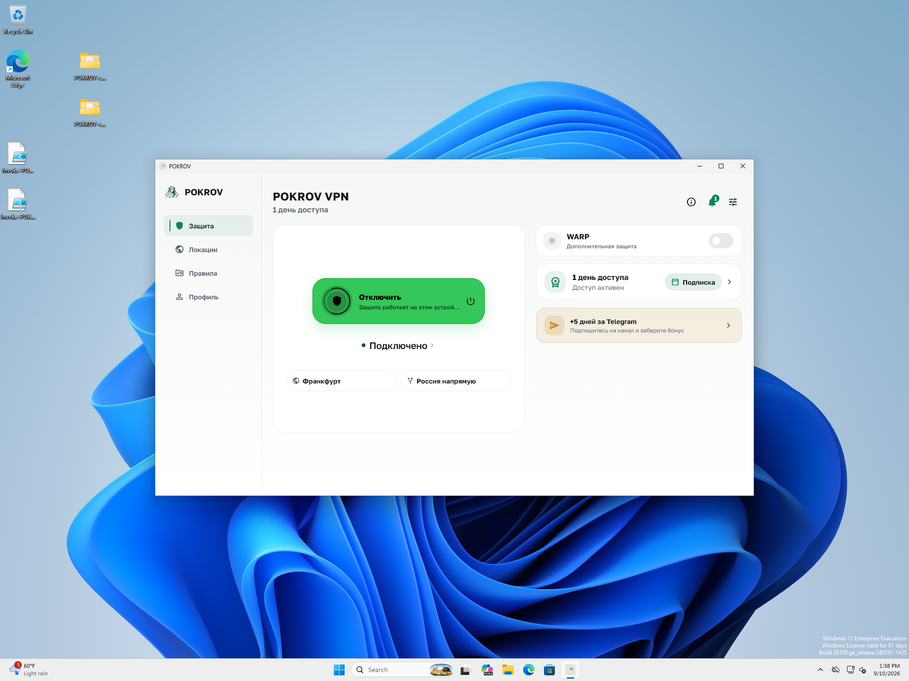

# V03 — disk full, очередь, часы и HTTP timeout

2026-09-10. **PASS_BOUNDED_V03_FAULTS**, client source
`6816aaba1e9526ba84182d8b13ecd20569e37d23`, Core `c7a11f7`, build `4053`.
[Validation](validation.json), [receipt](receipt.json).
Использован уже установленный пакет [PR101](../2026-09-10-r12-observability-startup/README.md):
304 hashes до/после совпадают. Новый код, build, PR, release и deploy не создавались.
Предыдущие PR/merge CI и signed tree относятся к тем же неизменённым исходникам.

## Установленный Windows и настоящий disk full

В owned Win11 VM создан отдельный VHD 32 MiB, NTFS volume 32436224 bytes,
label R12_OBS_FAULT. Diskpart выбирал только новый image по полному пути.
Обычный UAC Yes разрешил создание/отключение; ExecutionPolicy задан только
процессу PowerShell, постоянная policy не менялась. Первый запуск без параметра
не создал том и не перенёс данные; причина не классифицирована как продуктовый
дефект. Системный диск оставался доступным, свободно более 35 GB.

Два исходных diagnostic файла сохранены с хешами в соседнем каталоге. Только
diagnostic path временно направлен junction на свежий тестовый том. Заполнение
получило реальный Win32 ERROR_DISK_FULL (112), свободно 0 bytes; независимая
8 KiB запись получила тот же отказ. Operational JSONL не вырос (0 bytes).
Маленький exit marker занял 191 byte в NTFS resident storage, поэтому не
утверждается, что абсолютно любая запись на этом томе невозможна.

Приложение показало UI и подключилось при сохранённом disk-full состоянии.
Installed service, TUN/DNS/egress/effective match PASS; десять owned HTTPS 204
markers PASS. RX/TX TUN выросли на 24995 bytes каждый, включая фоновый трафик.
После disconnect route/DNS hashes совпали с исходными, TUN исчез, HTTPS доступен.
Исходные два журнала возвращены побайтно. Удалён только junction, VHD image
сохранён и отключён; drive R отсутствует. Defender enabled, новых 1116/1117 нет.
VM выключена ACPI, NIC none. Host network и телефон не изменялись.

## Текущие Dart-исходники: четыре проверки

`flutter test --no-pub E:/r12-observability-faults-20260910/faults_test.dart`
из exact-source `packages/app_shell`: **4 PASS**. [Лог](source-faults-first.log).
Пять package-config roots разрешаются в тот же worktree и связаны с Git tree;
исходники packages не имеют diff. Подписанные fixture key-set helpers взяты из
существующего test с сохранённым SHA; ключи временные, private bytes не выводились.

| Сценарий | Наблюдение |
| --- | --- |
| Corrupt JSONL + schema 999 marker | Bootstrap/UI-ready и connection callback прошли; APP-BOOT-008, incomplete tail восстановлен, invalid complete line учтена |
| 20000 событий + зависшая отправка release health | Queue 4096 / 3292083 bytes; 15904 info drops учтены; callback 529 µs до снятия блокировки; после снятия очередь пуста |
| Diagnostic clock −1 day / +365 days | Sequence 0–5; durations 0/86400000 ms; сохранён failed terminal CORE-003; OS clock не менялся |
| Настоящий loopback HTTP не возвращает chunk headers | Три timeout; concurrent callback 209 µs; encrypted outbox 2407 bytes сохранён, result offlineEncrypted/upload_deferred |

Микросекунды — наблюдения harness, не runtime performance gate. HTTP test
использует настоящий AppFirstSupportTicketService и его timeout, но synthetic
responses и in-memory secure-storage plugin. Customer credentials/traffic нет.
Предыдущие 29 observability tests сохраняют доказательство двухсегментной
rotation и её configured caps, но не заменяют новый disk-full runtime result.

## Открытая граница

V03 **active/I4** для этого scope; V01 и полный runtime/privacy/release открыты.
Android/Win10 installed faults, OS-clock effects и заполнение общего системного
тома не проверялись. Fault-period durable local timeline не заявляется.
Timeout test доказывает сохранение одного encrypted bundle. Общий предел
накопленного support outbox не доказан: текущий PokrovFileSupportBundleOutbox
проверяет размер отдельного envelope при load, а aggregate cap в этом классе
отсутствует. Поэтому bounded-spool критерий целиком не закрыт; автоматическое
удаление retained bundles и новая retention policy здесь не вводились.

Первый network helper вызван без обязательного Label; итоговая baseline взята
из исправленного вызова network-before-valid.json. Исходный пустой capture
остался в локальном каталоге, в accepted evidence не включён.

Документация: client seed/docs contract, 33 platform tests, context audit,
706 local links и git diff --check PASS; команды и логи в receipt.
