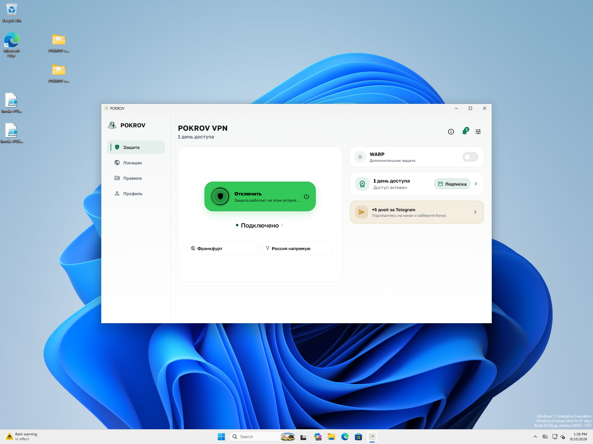

# V03 — запуск и VPN при отказе диагностического хранилища

2026-09-10. **PASS_BOUNDED_STORAGE_FAILURE**. Installed source
`6816aaba1e9526ba84182d8b13ecd20569e37d23`, Core `c7a11f7`, build `4053`.
PR [#101](https://github.com/Kiwunaka/POKROV-app/pull/101) merged
`1f6aeb5638d9f19df5b6a20db0d4b6fdcb0a9685`, signature и same-tree PASS.
PR CI PASS; merge CI PASS. [Receipt](receipt.json),
[runtime validation](runtime-validation.json), [payload](windows-payload-comparison.json).

## Дефект и исправление

Файл на месте каталога pokrov-observability вызывал PathExistsException во
время обязательного start перед runApp. External regression на прежнем
`71ae964` завершился FAIL. В installed Win11 VM тот же пакет оставался
без окна спустя 35 секунд. Это реальный конфликт пути, а не доказательство
поведения при физическом заполнении диска.

Инициализация локального журнала перенесена в существующий асинхронный writer,
который уже считает writerErrors и ограничивает очередь. Ошибки файловой
записи previous-exit marker больше не прерывают запуск, выход и crash handler;
writeErrors сохраняет их счётчик. Privacy validation остаётся перед IO.
Следующая batch повторяет запись в тот же путь. Нового хранилища и fallback нет.
Canonical behavior: [bootstrap workflow](../../../architecture/bootstrap-workflow.md).

## Проверка установленного приложения

Два исходных файла диагностики сохранены в соседнем каталоге с проверкой
полных хешей. На их месте создан собственный файл-фикстура с точным marker.
Session и secure storage не изменялись. Исправленный setup установлен обычным
мастером при активной фикстуре: все 304 файла совпали, 303 из них идентичны
предыдущему пакету; изменился только data/app.so. Setup SHA-256
`0c4ea5bb38bdcb75462394c21f8332fe07ede34b174660a8036ba74ac9dd04f4`, 29265572 bytes.

При том же отказе появился UI. После запуска через Ethernet bridge приложение
подключилось: installed service Running, TUN/DNS/egress и effective/staged
match PASS, десять owned HTTPS 204 markers PASS. TUN RX/TX выросли на 24756
bytes каждый; счётчики включают фоновый трафик и не атрибутируют отдельные
запросы. Фикстура и сохранённые журналы оставались неизменны во время трафика.
После disconnect точные route/DNS hashes восстановлены, TUN отсутствует,
внешний HTTPS marker доступен. Промежуточный network-connecting snapshot
пересекает применение маршрутов; принят steady connected snapshot.

После остановки отключённого UI удалён только собственный файл-фикстура,
оба исходных журнала возвращены с совпадением хешей. Новый запуск записал
четыре bootstrap events с source 6816aab/build 4053 и UI-ready succeeded.
Fault-period durable timeline не заявляется. Остановка процесса лабораторией
не доказывает пользовательский tray exit. Raw diagnostics не экспортировались.
Defender protections включены, новых detections/actions нет. VM ACPI off,
NIC none; host network не менялся. Старый установщик сохранён для отката.

## Проверки и границы

- `flutter test --no-pub test/client_observability_test.dart` в app_shell:
  6 PASS, включая bootstrap/UI-ready/connection callback, marker counters
  и повтор записи после устранения конфликта. Новый regression один.
- `flutter test --no-pub` в observability_runtime: 29 PASS.
- `flutter analyze --no-pub` для обоих пакетов: PASS.
- `scripts/validate-seed.ps1` с явными PlatformRoot/CoreRoot: PASS до сборки.
- `build.ps1`: offline bootstrap, Core sync и Windows release build PASS.
  SkipAnalyze/SkipTests/SkipValidateSeed относятся только к повтору уже
  выполненных проверок внутри builder. Шесть package trees совпали с tested
  integration; hosted CI проверяет точные PR и merge revisions отдельно.
- `verify-wizard.ps1`, `storage-fixture.ps1`, `timeline.ps1` и
  `validate-runtime.py`: результаты установленного пакета сохранены выше.

Harness prepare сначала встретил отсутствие GetRelativePath в PowerShell 5,
до записи данных; исправлен только helper. Первый promote остановлен guard
пока создание worktree не завершилось; remote action не произошёл.

V03 остаётся active/I3. Disk full, clock jump, event storm, queue/schema/upload
и полный Android/Win10 scope этим прогоном не закрыты; зависимость V01 открыта.
Телефон не использовался. Новый public binary release/candidate не публиковался.

Оформление: client seed и docs contract, 33 platform tests, context audit,
703 local links и diff check PASS. Точные команды и логи сохранены в receipt.
