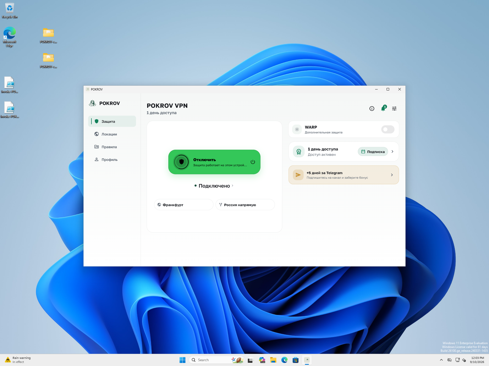
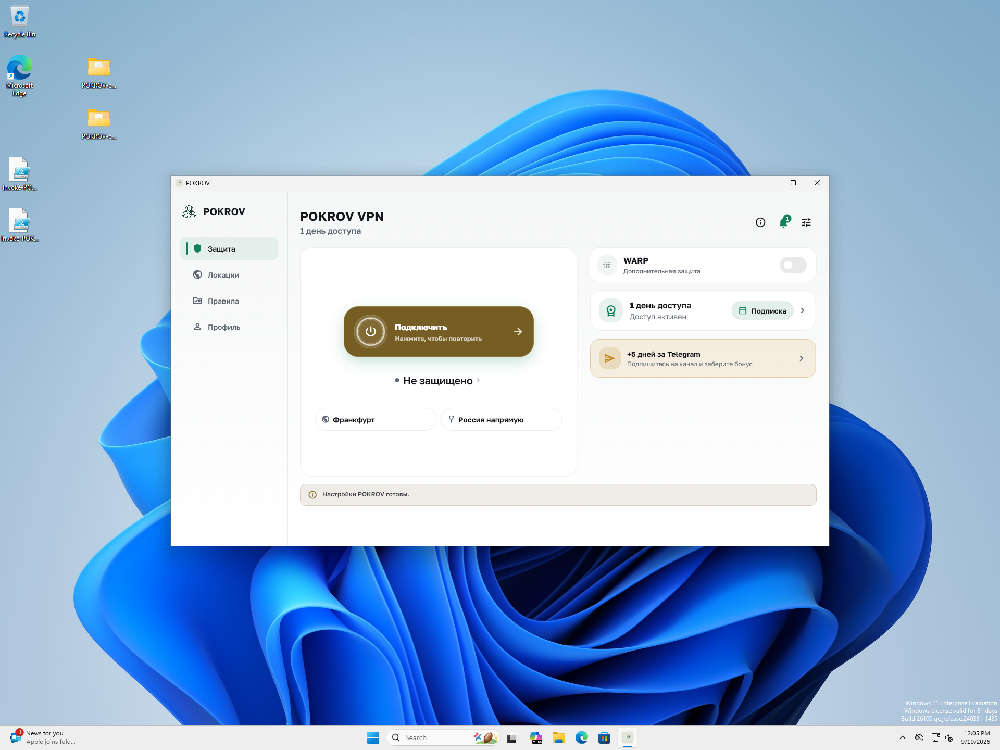

# Windows bridge: установленный клиент и восстановление

2026-09-10. **PASS_BOUNDED_INSTALLED_BRIDGE_CONNECT_AND_RECOVERY**.
[Receipt, команды-инструменты и хеши](receipt.json).
Client `c05b58b` / Core `c7a11f7`, current-origin owned Win11 VM.
Все 304 файла до/после совпали с прежним installed inventory.

По уточнению владельца использован уже сохранённый DPAPI-доступ к тестовой VM.
Обычный VirtualBox `controlvm setcredentials` выполнил вход: pokrovtest,
console session 1 Active, LoggedInUsers=1; рабочий стол просмотрен. Пароль
не выводился. Прежнее ожидание ручного Windows login снято; UAC, ACL и
политики аутентификации не менялись. Этот метод не доказывает UAC elevation.

Однодневный тестовый доступ истёк 2026-09-10 07:16:43 UTC. Точная isolated
app identity проверена по install hash и account binding. Штатный guarded
`user.extend` / action-intent продлил её до 2026-09-11 09:01:49 UTC;
платёж/refund не выполнялись. Это сохранённый тестовый grant, не покупка.

Bridge включён только у VM. Через обычную кнопку приложения получены
running/core_ready/dns_ready/egress_validated/effective_matches_staged=true.
Один TUN, изменённые routes/DNS и десять HTTPS 204 с правильным marker от
owned API подтверждены; счётчики TUN выросли на 24995 bytes в обе стороны.
Фоновый трафик гостя присутствовал: эти дельты не приписываются только запросам
и не доказывают выбранный процесс или внешнюю географию.

После кнопки отключения TUN отсутствует, running=false, routes и DNS hashes
точно совпали с baseline; аккаунт/установка и secure storage mode сохранены.
Внешний HTTPS probe снова успешен. VM выключена через ACPI, затем NIC=none:
исходный baseline предыдущей лабораторной задачи восстановлен.

Начальный отсутствующий Windows counter не записан как ноль: исходный error
сохранён, конечный collector явно использует .NET IPv4 statistics. Ошибка
кавычек в одном status command и transient showvminfo во время shutdown
также отделены от результата продукта. Все семь recovery assertions PASS.

Новая сборка `5a13ec7` не установлена; этот прогон закрывает прежний pending
installed-service bridge check, а не весь N01/N03/W01/W03 и не релиз.
Host VPN/network и binaries не менялись. Полный V03/privacy/chaos, Win10,
остальные protocols/origins и дальнейший exact candidate остаются открытыми.

Проверки оформления: client `validate-seed.ps1` с явными platform/Core roots — PASS; 33 platform docs tests, context audit и package validator (692 links) — PASS. Команды и хеши логов: [validation](validation.json). Временные password files удалены штатными finally-блоками; [readback](credential-cleanup.json).
