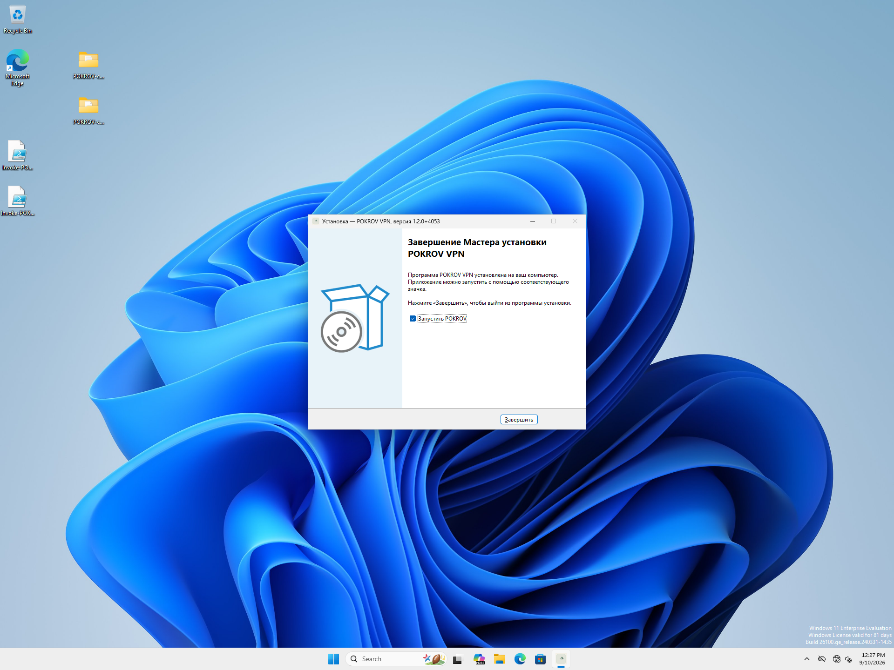
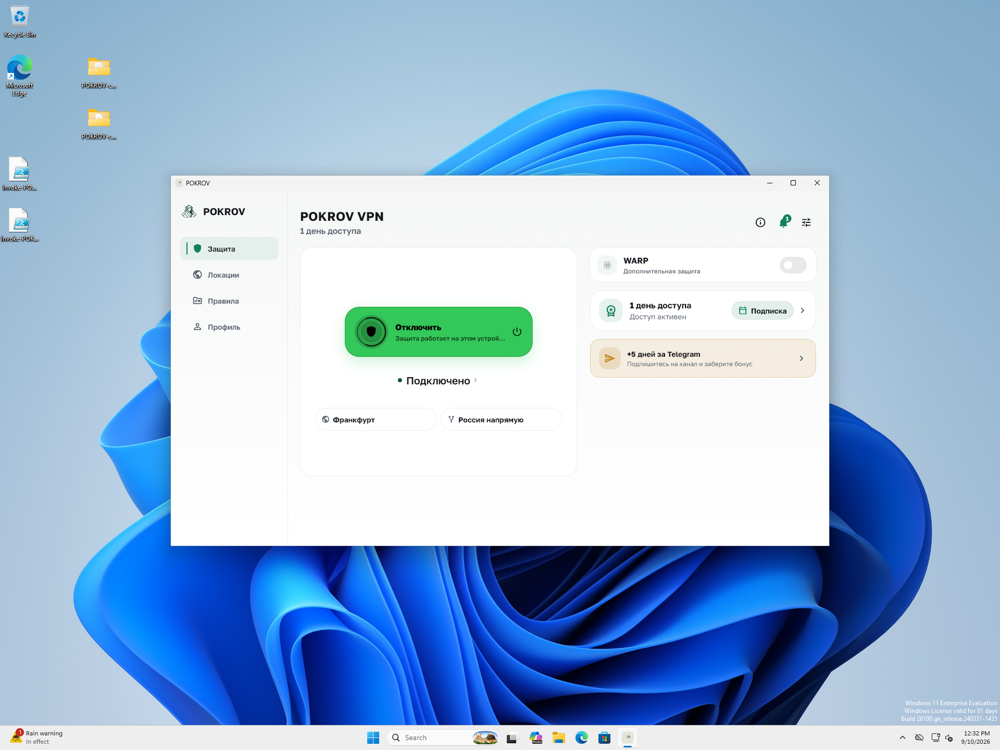
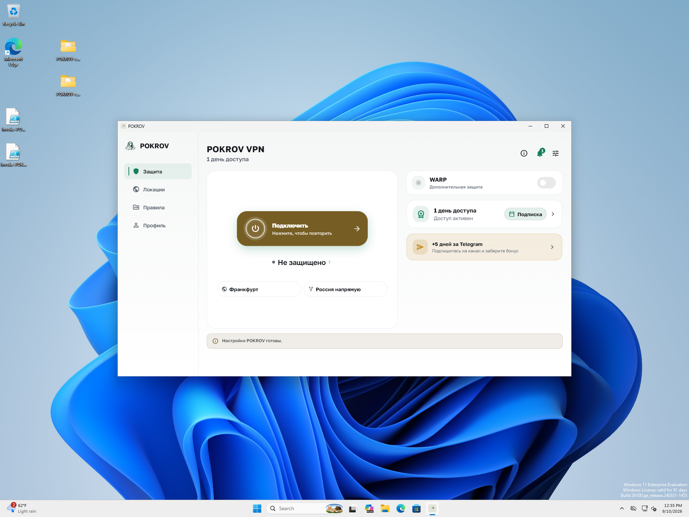

# Windows current package — установка, сеть и runtime self-report

2026-09-10, client `5a13ec7` / Core `c7a11f7`, owned Win11 VM через Ethernet bridge.
**PASS_BOUNDED runtime; FAIL automated install and diagnostic build metadata.**
[Receipt](receipt.json) связывает 24 captures, команды и хеши;
[validation](validation.json) сохраняет неуспешный metadata check.

Установлен exact setup `fadeb21e…c8e69b`, ранее проверенный в source/package
аудите. Начальный запуск PowerShell RunAs + silent setup был остановлен
Defender `Behavior:Win32/SuspClickFix.G2`: семь событий 1116/1117, старые bytes,
служба Stopped. Полученный wrapper exit 0 не принят за успешную установку.
События и исходный неполный install log сохранены.

Тот же setup установлен обычным графическим мастером. UAC показал Yes/No
для существующего admin account; пароль не вводился. Это другой сценарий,
чем ранее отклонённый ввод admin-пароля в standard-user clone. Defender,
UAC и ACL оставались включены и неизменны. Во время мастера и runtime
новых Defender 1116/1117 нет. 304/304 файлов совпали после установки и
runtime; session/secure-store bytes до первого запуска сохранились точно.
SCM service Running под LocalSystem. Предыдущий setup и inventory сохранены.

Обычный UI через Frankfurt / Russia-direct получил свежие TUN/DNS/egress и
effective/staged proof. Десять HTTPS 204 с правильным owned marker PASS;
TUN RX/TX выросли на 25036 bytes. Ambient guest traffic исключает
приписывание счётчиков только этим запросам или доказательство geolocation.
Disconnect восстановил точные routes/DNS hashes, удалил TUN; внешний HTTPS
проходил, install/account hashes и secure-only mode сохранены.

Brain read-only projection содержит шесть настоящих Windows runtime reports:
not_running → connect_requested → connected_ok/egress/match → not_running.
Сохранены только allowlisted projection и hashed trace, без raw event metadata,
account/device IDs, профилей и credentials. Это клиентский self-report;
он не становится самостоятельным серверным доказательством трафика.

Локальный run содержит 48 событий: UI-ready, auth refresh внутри connect,
verified и terminal, затем rollback/stop/terminal. В каждой generation sequence
непрерывен: 14/28/6 событий. Однако все 48 содержат нулевой `git_revision`.
Это реальный packaging defect: builder не передаёт существующие Dart defines.
Точный пакет доказан внешними hashes; metadata gate остаётся FAIL, исправление
сборщиков выполняется отдельно. Старое поле `client_source=0218e89` в runtime
probe — идентификатор диагностического helper, не установленного приложения.

Первый запуск не дал видимого окна; второй вызов поднял существующий UI.
После обычного отключения UI показал amber retry wording. Эти наблюдения
не превращены в F01/W02 PASS и требуют отдельной проверки/исправления.
Win10, protocol/IPv6/origin matrix, V01/V03 privacy/chaos и весь release открыты.
VM выключена ACPI, NIC none. Phone, host VPN и backend operator state не менялись.
Тестовый grant предыдущего прогона оставался действующим, повторно не продлевался.

Позднейшее исправление: [build identity](../2026-09-10-r12-build-identity/README.md). Исходные FAIL и captures этого прогона сохранены.

Проверки оформления обоих отчётов: client seed, 33 platform tests, context audit и 700 links PASS; команды и логи сохранены в receipt позднейшего исправления.
